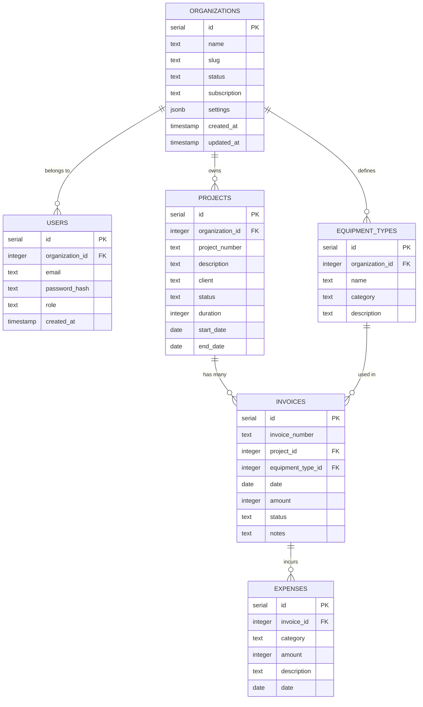

# Design Document

## Overview

The MVP Analytics Platform is a Next.js 15 application using App Router with Supabase for authentication and database services. The platform provides role-based dashboards for executives, project managers, operations, and finance users to manage and analyze project data, equipment usage, and financial metrics through manual data entry.

**Current Implementation Status**: 
- ✅ Next.js 15 with App Router setup
- ✅ Basic Supabase authentication (login/signup/logout)
- ✅ ShadCN UI components (Button, Input, Card, Label)
- ✅ Tailwind CSS v4 styling
- ✅ Basic middleware for route protection
- ❌ Multi-tenant organization structure (needs implementation)
- ❌ Database schema with Drizzle ORM (needs implementation)
- ❌ Role-based dashboards (needs implementation)
- ❌ Data management forms (needs implementation)
- ❌ Charts and analytics (needs implementation)

## Architecture

### High-Level Architecture


### Technology Stack

- **Frontend Framework**: Next.js 15 with App Router
- **Language**: TypeScript
- **Styling**: Tailwind CSS v4 + ShadCN UI components
- **Charts**: Recharts for data visualization
- **Authentication**: Supabase Auth
- **Database**: PostgreSQL via Supabase
- **ORM**: Drizzle ORM
- **Backend Logic**: Next.js Server Actions
- **Hosting**: Vercel (frontend) + Supabase (backend services)

## Components and Interfaces

### Current Application Structure

```
src/
├── app/
│   ├── auth/ (✅ IMPLEMENTED)
│   │   ├── login/page.tsx
│   │   ├── sign-up/page.tsx
│   │   ├── forgot-password/page.tsx
│   │   ├── update-password/page.tsx
│   │   ├── error/page.tsx
│   │   ├── sign-up-success/page.tsx
│   │   └── confirm/route.ts
│   ├── protected/ (✅ BASIC IMPLEMENTATION)
│   │   └── page.tsx (basic protected route)
│   ├── globals.css
│   ├── layout.tsx
│   └── page.tsx
├── lib/ (✅ BASIC IMPLEMENTATION)
│   ├── client.ts (Supabase browser client)
│   ├── server.ts (Supabase server client)
│   ├── middleware.ts (auth middleware)
│   └── utils.ts
├── components/ (✅ PARTIAL IMPLEMENTATION)
│   ├── ui/ (ShadCN components)
│   │   ├── button.tsx
│   │   ├── card.tsx
│   │   ├── input.tsx
│   │   └── label.tsx
│   ├── login-form.tsx
│   ├── sign-up-form.tsx
│   ├── forgot-password-form.tsx
│   ├── update-password-form.tsx
│   └── logout-button.tsx
└── middleware.ts (✅ BASIC IMPLEMENTATION)
```

### Target Application Structure (TO BE IMPLEMENTED)

```
src/
├── app/
│   ├── auth/ (✅ DONE)
│   ├── (dashboard)/ (❌ NEEDS IMPLEMENTATION)
│   │   ├── layout.tsx (protected layout with org context)
│   │   ├── dashboard/
│   │   │   └── page.tsx (role-based landing)
│   │   ├── organization/
│   │   │   ├── settings/page.tsx
│   │   │   ├── users/page.tsx
│   │   │   └── subscription/page.tsx
│   │   ├── projects/
│   │   │   ├── page.tsx
│   │   │   └── [id]/page.tsx
│   │   ├── equipment-types/page.tsx
│   │   ├── invoices/
│   │   │   ├── page.tsx
│   │   │   └── [id]/page.tsx
│   │   └── expenses/
│   │       ├── page.tsx
│   │       └── [id]/page.tsx
├── components/
│   ├── ui/ (ShadCN components)
│   ├── forms/
│   │   ├── organization-form.tsx
│   │   ├── user-invite-form.tsx
│   │   ├── project-form.tsx
│   │   ├── equipment-type-form.tsx
│   │   ├── invoice-form.tsx
│   │   └── expense-form.tsx
│   ├── charts/
│   │   ├── kpi-card.tsx
│   │   ├── revenue-chart.tsx
│   │   ├── project-status-chart.tsx
│   │   └── equipment-profitability-chart.tsx
│   ├── dashboard/
│   │   ├── executive-dashboard.tsx
│   │   ├── project-manager-dashboard.tsx
│   │   ├── operations-dashboard.tsx
│   │   └── finance-dashboard.tsx
│   ├── organization/
│   │   ├── organization-settings.tsx
│   │   ├── user-management.tsx
│   │   ├── subscription-management.tsx
│   │   └── organization-switcher.tsx
│   └── navigation/
│       ├── sidebar.tsx
│       └── role-nav.tsx
├── lib/ (❌ NEEDS EXPANSION)
│   ├── db/ (❌ NEEDS IMPLEMENTATION)
│   │   ├── schema.ts (Drizzle schema)
│   │   ├── queries.ts (database queries)
│   │   └── index.ts (connection setup)
│   ├── actions/ (❌ NEEDS IMPLEMENTATION)
│   │   ├── projects.ts
│   │   ├── equipment-types.ts
│   │   ├── invoices.ts
│   │   └── expenses.ts
│   └── utils/ (❌ NEEDS EXPANSION)
│       ├── calculations.ts
│       ├── validations.ts
│       └── formatters.ts
└── middleware.ts (✅ BASIC IMPLEMENTATION, NEEDS ENHANCEMENT)
```

### Core Components

#### Authentication Components
- **LoginForm**: Supabase Auth integration with role-based redirect
- **AuthProvider**: Context for authentication state management
- **ProtectedRoute**: Middleware for route protection

#### Dashboard Components
- **ExecutiveDashboard**: KPIs, portfolio status, financial summary
- **ProjectManagerDashboard**: Project status, budget tracking, risk indicators
- **OperationsDashboard**: Equipment utilization, cost trends, capacity planning
- **FinanceDashboard**: Cash flow, profitability analysis, cost breakdowns

#### Form Components
- **ProjectForm**: Project creation/editing with validation
- **EquipmentTypeForm**: Equipment type management
- **InvoiceForm**: Invoice entry with project/equipment linking
- **ExpenseForm**: Expense tracking linked to invoices

#### Chart Components
- **KPICard**: Reusable metric display component
- **RevenueChart**: Monthly revenue trends
- **ProjectStatusChart**: Project distribution by status
- **EquipmentProfitabilityChart**: Equipment type performance

## Data Models

### Multi-Tenant Database Design

The platform uses a multi-tenant SaaS architecture to support multiple organizations with complete data isolation. The database design is detailed in `docs/db-design.md` and includes Row Level Security (RLS) for secure multi-tenancy.

### Core Tables (Multi-Tenant Implementation)

```typescript
// Organizations table - Master table for multi-tenancy
export const organizations = pgTable('organizations', {
  id: serial('id').primaryKey(),
  name: text('name').notNull(),
  slug: text('slug').notNull().unique(), // URL-friendly identifier
  status: text('status').notNull().default('active'), // 'active', 'inactive', 'trial'
  subscription: text('subscription').notNull().default('basic'), // 'basic', 'premium', 'enterprise'
  settings: jsonb('settings').default('{}'), // Org-specific configurations
  createdAt: timestamp('created_at').defaultNow(),
  updatedAt: timestamp('updated_at').defaultNow(),
});

// Users table - Authentication & roles (organization-scoped)
export const users = pgTable('users', {
  id: serial('id').primaryKey(),
  organizationId: integer('organization_id').references(() => organizations.id).notNull(),
  email: text('email').notNull(), // Unique within organization
  passwordHash: text('password_hash').notNull(), // Supabase handles hashing
  role: text('role').notNull(), // 'executive', 'project_manager', 'operations', 'finance'
  createdAt: timestamp('created_at').defaultNow(),
});

// Projects table - Project metadata (organization-scoped)
export const projects = pgTable('projects', {
  id: serial('id').primaryKey(),
  organizationId: integer('organization_id').references(() => organizations.id).notNull(),
  projectNumber: text('project_number').notNull(), // e.g. "STP 002"
  description: text('description'),
  client: text('client').notNull(),
  status: text('status').notNull(), // 'active', 'completed', 'at_risk'
  duration: integer('duration').notNull(), // in days
  startDate: date('start_date').notNull(),
  endDate: date('end_date').notNull(),
});

// Equipment Types table - Master list of reusable equipment (organization-scoped)
export const equipmentTypes = pgTable('equipment_types', {
  id: serial('id').primaryKey(),
  organizationId: integer('organization_id').references(() => organizations.id).notNull(),
  name: text('name').notNull(), // e.g. "Tipper", "Grader"
  category: text('category'), // e.g. "Heavy", "Light"
  description: text('description'),
});

// Invoices table - Equipment usage per project with revenue (inherits organization through project)
export const invoices = pgTable('invoices', {
  id: serial('id').primaryKey(),
  invoiceNumber: text('invoice_number'),
  projectId: integer('project_id').references(() => projects.id).notNull(),
  equipmentTypeId: integer('equipment_type_id').references(() => equipmentTypes.id).notNull(),
  date: date('date').notNull(),
  amount: integer('amount').notNull(), // Revenue for this equipment use
  status: text('status').notNull(), // 'paid', 'pending', 'overdue'
  notes: text('notes'),
});

// Expenses table - Costs linked to invoices (inherits organization through invoice → project)
export const expenses = pgTable('expenses', {
  id: serial('id').primaryKey(),
  invoiceId: integer('invoice_id').references(() => invoices.id).notNull(),
  category: text('category').notNull(), // e.g. 'fuel', 'salary', 'maintenance'
  amount: integer('amount').notNull(), // Cost in cents or full currency
  description: text('description'),
  date: date('date').notNull(),
});
```

### Multi-Tenant Benefits

✅ **Complete Data Isolation** - Organizations cannot access each other's data
✅ **Built-in Security** - Row Level Security (RLS) policies enforce tenant boundaries
✅ **SaaS Ready** - Subscription management and billing integration ready
✅ **Scalable Architecture** - Single database, multiple tenants with shared infrastructure
✅ **Customizable** - Organization-specific settings and configurations

### Row Level Security (RLS) Implementation

Supabase RLS policies ensure complete data isolation:

```sql
-- Users can only access their own organization's data
CREATE POLICY "Users can only access their organization" ON users
  FOR ALL USING (organization_id = (
    SELECT organization_id FROM users WHERE id = auth.uid()
  ));

-- Projects scoped to organization
CREATE POLICY "Projects scoped to organization" ON projects
  FOR ALL USING (organization_id = (
    SELECT organization_id FROM users WHERE id = auth.uid()
  ));

-- Equipment types scoped to organization
CREATE POLICY "Equipment types scoped to organization" ON equipment_types
  FOR ALL USING (organization_id = (
    SELECT organization_id FROM users WHERE id = auth.uid()
  ));

-- Invoices inherit organization through projects
CREATE POLICY "Invoices scoped to organization" ON invoices
  FOR ALL USING (
    project_id IN (
      SELECT id FROM projects 
      WHERE organization_id = (
        SELECT organization_id FROM users WHERE id = auth.uid()
      )
    )
  );

-- Expenses inherit organization through invoices → projects
CREATE POLICY "Expenses scoped to organization" ON expenses
  FOR ALL USING (
    invoice_id IN (
      SELECT i.id FROM invoices i
      JOIN projects p ON i.project_id = p.id
      WHERE p.organization_id = (
        SELECT organization_id FROM users WHERE id = auth.uid()
      )
    )
  );
```

### Organization-Scoped Business Metrics

All calculations are automatically scoped to the user's organization:

```sql
-- Total revenue per equipment type (organization-scoped)
SELECT 
  et.name, 
  SUM(i.amount) as revenue
FROM invoices i
JOIN equipment_types et ON i.equipment_type_id = et.id
JOIN projects p ON i.project_id = p.id
WHERE p.organization_id = $1  -- Current user's organization
GROUP BY et.name;

-- Profit per equipment type (organization-scoped)
SELECT
  et.name,
  SUM(i.amount) AS revenue,
  COALESCE(SUM(e.amount), 0) AS costs,
  SUM(i.amount) - COALESCE(SUM(e.amount), 0) AS profit
FROM invoices i
JOIN equipment_types et ON i.equipment_type_id = et.id
JOIN projects p ON i.project_id = p.id
LEFT JOIN expenses e ON e.invoice_id = i.id
WHERE p.organization_id = $1  -- Current user's organization
GROUP BY et.name;
```

### Data Relationships



## Error Handling

### Client-Side Error Handling
- **Form Validation**: Zod schemas for type-safe validation
- **Error Boundaries**: React error boundaries for component-level error handling
- **Toast Notifications**: User-friendly error messages using ShadCN toast component
- **Loading States**: Proper loading indicators during async operations

### Server-Side Error Handling
- **Server Actions**: Try-catch blocks with proper error responses
- **Database Errors**: Drizzle ORM error handling with meaningful messages
- **Authentication Errors**: Supabase auth error handling and redirects
- **Validation Errors**: Server-side validation with detailed error responses

### Error Types and Responses

```typescript
// Error response interface
interface ActionResult<T> {
  success: boolean;
  data?: T;
  error?: {
    message: string;
    field?: string;
    code?: string;
  };
}

// Common error scenarios
- Authentication failures → Redirect to login
- Validation errors → Field-specific error messages
- Database constraints → User-friendly constraint violation messages
- Network errors → Retry mechanisms with user feedback
- Permission errors → Access denied messages with role context
```

## Testing Strategy

### Unit Testing
- **Components**: React Testing Library for component behavior
- **Server Actions**: Jest for business logic testing
- **Utilities**: Pure function testing for calculations and validations
- **Database Queries**: Drizzle query testing with test database

### Integration Testing
- **Authentication Flow**: End-to-end auth testing with Supabase
- **Data Flow**: Form submission to database persistence
- **Role-Based Access**: Permission testing across different user roles
- **Dashboard Data**: Chart rendering with mock data

### Manual Testing Scenarios
- **Role Switching**: Test dashboard views for each role
- **Data Entry Workflows**: Complete project → invoice → expense flow
- **Edge Cases**: Invalid data entry, network failures, session expiry
- **Performance**: Dashboard loading with realistic data volumes

### Testing Tools
- **Jest**: Unit and integration testing framework
- **React Testing Library**: Component testing utilities
- **Playwright**: End-to-end testing for critical user flows
- **MSW (Mock Service Worker)**: API mocking for isolated testing

## Security Considerations

### Authentication & Authorization
- **Supabase Auth**: Secure authentication with JWT tokens
- **Role-Based Access Control**: Server-side role verification
- **Route Protection**: Middleware-based route protection
- **Session Management**: Secure session handling with automatic refresh

### Data Security
- **Input Validation**: Server-side validation for all user inputs
- **SQL Injection Prevention**: Drizzle ORM parameterized queries
- **XSS Protection**: React's built-in XSS protection + input sanitization
- **CSRF Protection**: Next.js built-in CSRF protection for Server Actions

### Environment Security
- **Environment Variables**: Secure storage of API keys and secrets
- **HTTPS Enforcement**: SSL/TLS encryption via Vercel
- **Database Security**: Supabase Row Level Security (RLS) policies
- **API Rate Limiting**: Supabase built-in rate limiting

## Performance Optimization

### Frontend Performance
- **Code Splitting**: Next.js automatic code splitting
- **Image Optimization**: Next.js Image component for optimized images
- **Caching**: React Query for client-side data caching
- **Bundle Analysis**: Regular bundle size monitoring

### Database Performance
- **Indexing**: Proper database indexes for query optimization
- **Query Optimization**: Efficient Drizzle queries with joins
- **Connection Pooling**: Supabase connection pooling
- **Data Pagination**: Implement pagination for large datasets

### Monitoring
- **Vercel Analytics**: Performance monitoring and insights
- **Error Tracking**: Sentry integration for error monitoring
- **Database Monitoring**: Supabase dashboard monitoring
- **User Experience**: Core Web Vitals tracking